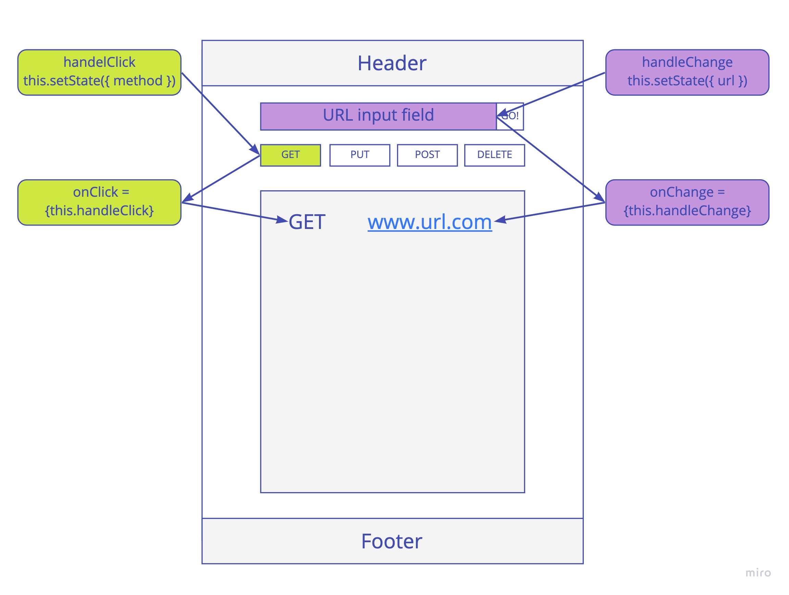

# RESTy
# Author: Lydia Minehan-Tubic

## Links & Resources

✨ [Deployed Site](https://flamboyant-kepler-b6da40.netlify.app/)

✨ [Pull Request](https://github.com/LydiaMT/resty/pull/3)

## About this Application 

An API testing tool that can be run in any browser, allowing a user to easily interact with APIs in a familiar interface.

## Dependencies

- node-sass
- react
- react-dom
- react-scripts

## Scaffolding

```git 
├── .gitignore
├── .eslintrc.json
├── __tests__
│   ├── app.test.js
│   ├── form.test.js
│   ├── history.test.js
│   ├── results.test.js
├── src
│   ├── index.js
│   ├── app.js
│   ├── components
│   │   ├── if
│   │   │   └── if.js
│   │   ├── form
│   │   │   └── form.js
│   │   │   └── form.scss
│   │   ├── history
│   │   │   └── history.js
│   │   │   └── history.scss
│   │   ├── results
│   │   │   └── results.js
│   │   │   └── results.scss
│   │   ├── header
│   │   │   └── header.js
│   │   │   └── header.scss
│   ├── design
│   │   └── variables.scss
│   │   └── design.scss
└── package.json
```
# Day 1

## Event Flow



# Day 2

## Application flow
- User enters an API URL
- Chooses a REST Method
- Clicks the “Go” button
- Application fetches data from the URL given, with the method specified
- Displays the response headers and results separately
- Both headers and results should be “pretty printed” JSON